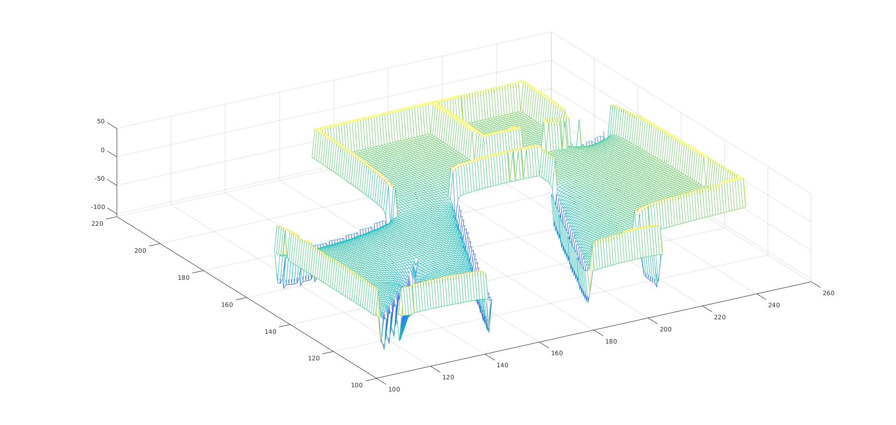

# Overview
The repo implements multiple targets based Artifical Potential Field (APF) based on feasible distance.

This matlab repo is just for debug and test algorithm and thus no comments are provided.

## Files Descriptions
- myapf.m is the main function to start APF progarm in the map stored in apf.mat.
- potential_viewer.m is the main function to view the created 3D potential field.
- calculate_potentialmap.m is the main function to calculate whole potential field view given the starting location.
- map_distance_generation_with_map.m is the supporting function to calcuate the feasible distance given map, starting location, all targets locations and all obstacle locations.
- computNewPotentialMultiGoal_with_map.m is the supporting function to calculate the potential value specific location named curr given map, starting location, all targets locations and all obstacle locations.

# potential_viewer.m 
Result is 

# myapf.m
Result is 
